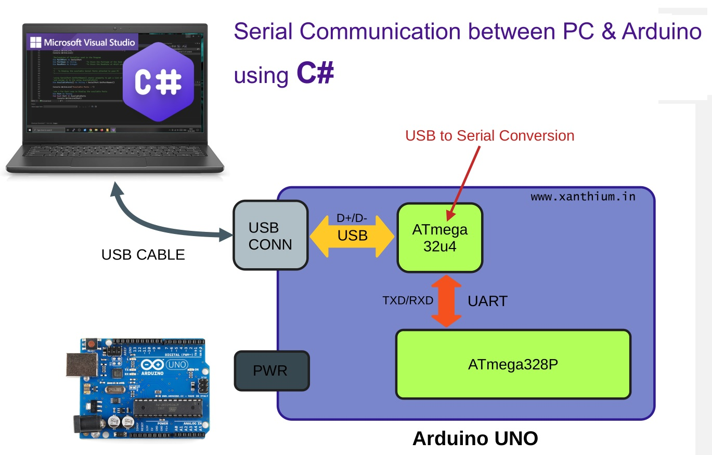

# Bidaoui-Arduino
#### seril communication between computer and arduino :

<div>


<div>


## Structure d'un câble USB

####  USB cable Wires :
<table>
    <tr>
        <td></td>
        <td>
            <table >
                    <tr>
                        <th>Fil</th>
                        <th>Couleur</th>
                        <th>Fonction</th>
                    </tr>
                    <tr>
                        <td><code>VCC (5V)</code></td>
                        <td>Rouge</td>
                        <td>Alimentation (5V DC)</td>
                    </tr>
                    <tr>
                        <td><code>D+</code></td>
                        <td>Vert</td>
                        <td>Transmission de données</td>
                    </tr>
                    <tr>
                        <td><code>D-</code></td>
                        <td>Blanc</td>
                        <td>Réception de données</td>
                    </tr>
                    <tr>
                        <td><code>GND</code></td>
                        <td>Noir</td>
                        <td>Masse électrique</td>
                    </tr>
            </table>
        </td>
    </tr>
</table>


## Convertisseurs USB-UART :
### A USB-to-Serial chip (e.g., CH340, FTDI, ATmega16U2) converts UART signals into USB.
<div>


<div>
. The Arduino uses UART to send data (TX/RX).

## Code C# (WinForms) :
```
using System;
using System.IO.Ports;
using System.Windows.Forms;

namespace ArduinoControl
{
    public partial class Form1 : Form
    {
        SerialPort serialPort = new SerialPort("COM3", 9600); 

        public Form1()
        {
            InitializeComponent();
            serialPort.Open();  
        }

        private void btnOn_Click(object sender, EventArgs e)
        {
            serialPort.Write("1");  
        }

        private void btnOff_Click(object sender, EventArgs e)
        {
            serialPort.Write("0");  
        }

        private void Form1_FormClosing(object sender, FormClosingEventArgs e)
        {
            if (serialPort.IsOpen)
                serialPort.Close();  
        }
    }
}

```
## Code arduino : 
```
int ledPin = 13;  
char command;  

void setup() {
    pinMode(ledPin, OUTPUT);
    Serial.begin(9600);  
}

void loop() {
    if (Serial.available() > 0) {  
        command = Serial.read();  
        if (command == '1') {
            digitalWrite(ledPin, HIGH);  
        } else if (command == '0') {
            digitalWrite(ledPin, LOW);   
        }
    }
}

```

- [library I/O ports](https://learn.microsoft.com/en-us/dotnet/api/system.io.ports.serialport?view=net-9.0-pp) - serial port communication in C# using the .NET framework.
- [library serial arduino](https://learn.microsoft.com/en-us/dotnet/api/system.io.ports.serialport?view=net-9.0-pp) -communication between the Arduino board and a computer or other devices.

## test for select color RGB and send to Arduino :
### Code C# (WinForms) :
```
private Color selectedColor;

    private void BtnChooseColor_Click(object sender, EventArgs e)
    {
        ColorDialog colorDialog = new ColorDialog();
        if (colorDialog.ShowDialog() == DialogResult.OK)
        {
            selectedColor = colorDialog.Color;
            lblColor.BackColor = selectedColor;
            lblRGB.Text = $"RGB: {selectedColor.R}, {selectedColor.G}, {selectedColor.B}";
        }
    }

    private void BtnSend_Click(object sender, EventArgs e)
    {
        if (!serialPort.IsOpen)
            serialPort.Open();

        string data = $"{selectedColor.R},{selectedColor.G},{selectedColor.B}\n";
        serialPort.WriteLine(data);
        MessageBox.Show("Données envoyées: " + data);
    }
```
### Code Arduino :
```
#include <Arduino.h>

int redPin = 9;
int greenPin = 10;
int bluePin = 11;

void setup() {
  Serial.begin(9600);
  pinMode(redPin, OUTPUT);
  pinMode(greenPin, OUTPUT);
  pinMode(bluePin, OUTPUT);
}

void loop() {
  if (Serial.available() > 0) {
    String data = Serial.readStringUntil('\n');  // Lire jusqu'à "\n"
    int r, g, b;
    sscanf(data.c_str(), "%d,%d,%d", &r, &g, &b);

    analogWrite(redPin, r);
    analogWrite(greenPin, g);
    analogWrite(bluePin, b);

    Serial.print("LED RGB: ");
    Serial.println(data);
  }
}

```
