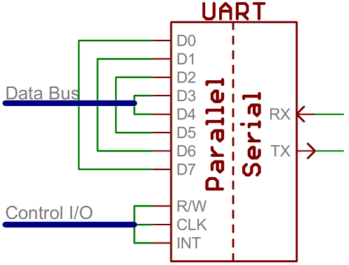
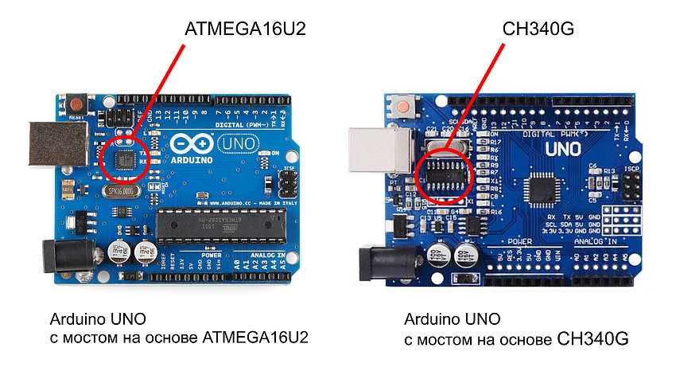
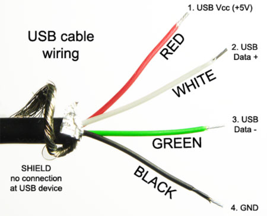

# Bidaoui-Arduino
learning programming Arduino with C# forms

Code arduino : 
```
int incomingByte = 0; // for incoming serial data

    void setup() {
      Serial.begin(9600); // opens serial port, sets data rate to 9600 bps
    }

    void loop() {
      // reply only when you receive data:
      if (Serial.available() > 0) {
        // read the incoming byte:
        incomingByte = Serial.read();

        // say what you got:
        Serial.print("I received: ");
        Serial.println(incomingByte, DEC);
      }
    }
```

[library I/O ports](https://learn.microsoft.com/en-us/dotnet/api/system.io.ports.serialport?view=net-9.0-pp) - serial io library

### Convertisseurs USB-UART :
<div>


<div>

## Structure d'un câble USB

####  Un câble USB standard contient 4 à 5 fils, selon la version :
<table>
    <tr>
        <td></td>
        <td>
            <table >
                    <tr>
                        <th>Fil</th>
                        <th>Couleur</th>
                        <th>Fonction</th>
                    </tr>
                    <tr>
                        <td><code>VCC (5V)</code></td>
                        <td>Rouge</td>
                        <td>Alimentation (5V DC)</td>
                    </tr>
                    <tr>
                        <td><code>D+</code></td>
                        <td>Vert</td>
                        <td>Transmission de données</td>
                    </tr>
                    <tr>
                        <td><code>D-</code></td>
                        <td>Blanc</td>
                        <td>Réception de données</td>
                    </tr>
                    <tr>
                        <td><code>GND</code></td>
                        <td>Noir</td>
                        <td>Masse électrique</td>
                    </tr>
            </table>
        </td>
    </tr>
</table>

|  Fil|   Couleur   |     Fonction            |
| :-------- | :------- | :------------------------- |
| `VCC (5V)` | Rouge  |Alimentation (5V DC) |
| `D+` | Vert |Transmission de données|
| `D-` | Blanc |		Réception de données|
| `GND` | Noir |Masse électrique|

